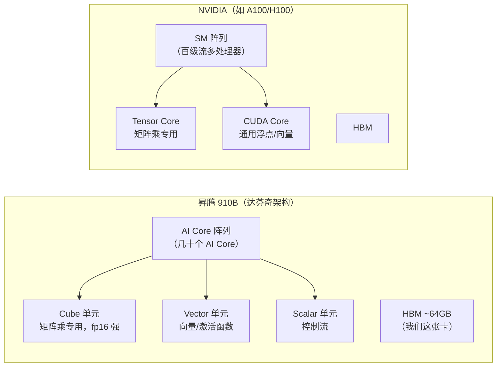

# 昇腾 910 vs 英伟达 GPU：一个推理优化项目的全方位对比

> 场景：我在华为昇腾 910B2（NPU）上完成了 MiniCPM-o 4.5 语音大模型的推理优化
> （RTF 0.751 → 0.5238，−30%）。本文回答两个问题：
> **① 这两类芯片到底有什么区别？② 这些区别如何影响了我的优化工作？**
>
> 写给：熟悉 NVIDIA/CUDA 基本概念的读者（面试官视角友好），也适合自学复盘。

---

## 1. 三十秒版本（电梯演讲）

> **硬件上**：NPU 和 GPU 都是" thousands of 小计算核心 + HBM 高带宽显存"的并行
> 加速器，宏观结构相似；区别在于 NPU 的 AI Core 内置专用的 **Cube 矩阵单元**
> （达芬奇架构，为矩阵乘定制），GPU 靠 **Tensor Core** 承担同样角色。
> **软件上**：差距远大于硬件。CUDA 生态有 15 年积累；昇腾的 CANN 生态还在
> 快速追赶期——这既意味着踩坑多，也意味着"补生态空白"本身就成了我工作的一部分。

一句话总结对项目的影响：

> **在 GPU 上，我的时间会花在"把 kernel 算得更快"；在 NPU 上，我大量时间花在
> "减少 kernel 发射次数 + 补平台兼容层 + 排查生态边角问题"——但性能优化的
> 方法论（profile → 判断瓶颈类型 → 数学等价变换 → 门禁回归）完全通用。**

---

## 2. 硬件架构对比

| 维度 | 昇腾 910B2（本项目） | NVIDIA GPU（对照） | 对我的影响 |
|---|---|---|---|
| 计算单元 | 达芬奇 AI Core：Cube（矩阵）+ Vector（向量）+ Scalar | SM：Tensor Core + CUDA Core | 大矩阵乘两者都快；**小算子发射开销 NPU 上更疼**（见 §4.1） |
| 显存 | HBM 64GB 单卡 | HBM（A100 80GB 等） | 容量不是瓶颈；瓶颈在调度 |
| 主机 CPU | **鲲鹏 aarch64（ARM）**，256 核 | 多为 x86 EPYC/Xeon | ARM 生态踩坑：个别 wheel 要自编译、部分库假设 x86（见 §4.5） |
| 指令/驱动层 | AscendCL（对标 CUDA Driver API） | CUDA Driver/Runtime | 概念可映射，API 不通用 |
| 板卡管理 | `npu-smi` / msnpureport | `nvidia-smi` / DCGM | 排障命令体系平级 |

**关键认知**：硬件规格表上的差距（算力/带宽）往往不是决定性因素——
**真正决定优化路径的是"算子发射（launch）开销 × 软件栈成熟度"**。这两点在 NPU
上塑造了完全不同的优化优先级。

---

## 3. 软件栈映射表（面试速查）

| 职责 | 昇腾生态 | NVIDIA 生态 | 本项目用到 |
|---|---|---|---|
| 基础工具包 | **CANN** | CUDA Toolkit | CANN 9.0.0 |
| 深度学习算子库 | aclnn / ATB（Ascend Transformer Boost） | cuDNN / cuBLAS / CUTLASS | 隐式经 torch-npu 调用 |
| PyTorch 后端 | **torch-npu**（`device="npu"`） | torch cuda（`device="cuda"`） | 全程 |
| 整图执行 | **aclgraph / NPUGraph** | CUDA Graph | ✅ 核心优化（§4.2） |
| 图编译 | torchair（盘古图） | torch.compile / TensorRT | 部分概念对照 |
| 集合通信 | HCCL | NCCL | 单卡未直接用 |
| Profiler | torch_npu profiler / msprof | Nsight Systems / nvprof | 定位 launch-bound |
| 推理框架平台层 | **vllm-ascend**（平台插件） | vLLM 原生 CUDA 后端 | ✅ 三阶段平台配置 |
| 多媒体处理 | DVPP / aclvv | DALI / ffmpeg + GPU | TTS 音频链路 CPU 处理 |

**面试话术**：被问"你没写过 CUDA，怎么保证能力可迁移？"——
"我做的不是写 kernel，而是**推理系统优化**：profile 定位瓶颈、CFM 积分学分析、
bucket 批处理约束分析、图捕获重放、配置注入层设计。这些在哪个后端都是同一套
方法论；我在 NPU 上还额外多做了平台兼容层——等于反向证明了我不依赖单一生态。"

---

## 4. 六个具体差异 & 它们如何影响本项目

### 4.1 小算子发射开销：launch-bound 是 NPU 的"阿喀琉斯之踵"

**现象**：stage2（Code2Wav：CFM DiT + HiFT vocoder）profiling 显示每个 mel
chunk 的解码链由 **~200 次小算子下发**组成，NPU 计算单元大量时间在等 launch。

**GPU 对照**：CUDA 的 kernel launch 开销经驱动优化多年（~几 µs 级），小算子
密集的模型在 GPU 上痛苦程度低得多；NPU 的 aicpu/aicore 调度路径更长，
小 kernel 的相对开销更高。

**对本项目的影响（核心）**：
- fp16 autocast 实验**无加速**（compute 不是瓶颈，cast 反而多加算子）→ 负结果；
- 优化主线被迫转向"**减 launch 次数**"：CFM 循环微融合（消除每步 `cat` 大分配
  + 2 次标量 kernel）、chunk 加倍（25→50 帧，launch 次数减半）、NPUGraph 整图
  重放（~200 次 launch → 每图 1 次 replay）。
- **这是理解本文档所有 stage2 优化的钥匙**：不是"NPU 算不动"，是"发射太贵"。

### 4.2 图执行：NPUGraph vs CUDA Graph——概念同源，细节有坑

本项目最大的单项优化（RTF 0.53 → 0.5174）就是 cherry-pick 公开 PR 并适配的
**Code2Wav NPUGraph 整图重放**：

| 环节 | CUDA Graph（GPU 惯例） | NPUGraph（本项目实际） |
|---|---|---|
| 捕获 | `torch.cuda.graph(g)`，静态输入/输出 | `torch.npu.graph(g, pool=共享池)`，同样静态化 |
| 重放 | 拷入静态输入 → `g.replay()` | 相同：`static.copy_(cur)` → `graph.replay()` → **必须 `clone()` 输出**（NPU 图输出会被下一次 replay 覆写，流式 cache 直接持有会串音） |
| 签名分档 | 按 shape 分桶捕获 | 同样 exact-shape 分档，32 档上限，miss 回退 eager |
| NPU 特有坑 | — | ① 捕获前 `npu.set_compile_mode(jit_compile=False)` + `allow_internal_format=False`（否则图内有 jit 编译/格式转换，重放即错）；② 捕获失败后 allocator/RNG 状态可能已污染，**必须熔断重启进程**而非静默重试；③ 与 `ASCEND_LAUNCH_BLOCKING=1` 调试模式互斥 |

**迁移价值**：这套"exact-shape 捕获 + 失败熔断 + miss 回退"设计模式直接可以
搬到 CUDA Graph 场景——面试时这是"平台无关系统设计能力"的直接证据。

### 4.3 算子覆盖：融合算子有，但不是全覆盖

- stage0/stage1 主干（LlamaModel 结构的 RMSNorm/RoPE/attention）由
  **vllm-ascend 平台注册的融合算子**覆盖，零额外工作——对标 GPU 上
  FlashAttention + fused kernel 的角色。
- 但 stage2 的 CFM 单步（CFG 双调用 + concat/expand 链）**没有现成融合**，
  我做了循环级微融合：`torch.diff(timeline)` 一次预计算全部步长、`x_cfg` 缓冲
  区复用（`copy_` 替代 `cat`）——数学等价、字节级可验证。
- **差异本质**：GPU 上 "flash-attn 之类轮子都在"；NPU 上覆盖面在快速补齐，
  但你要有"自己动手做等价变换"的心理准备，还得会用 `sdpa_kernel(SDPBackend.MATH)`
  这类后端选择开关（NPU 图捕获要求 MATH 后端）。

### 4.4 内存与多进程：cgroup 32GB 假象 & knowledge-bank 陷阱

- 宿主 2TB 内存是假象，**容器 cgroup 上限 32GB**：三 stage 进程 + 评测进程
  合计超限 → 被 OOM kill，且 `dmesg` 无记录（容器内看不到宿主内核日志），
  表现为"静默崩溃"。排查靠 `EXIT:137`（SIGKILL）+ `/sys/fs/cgroup/memory/` 文件。
- **CANN 特有**：默认拉起 knowledge-bank 子进程常驻数 GB——设
  `CANN_KNOWLEDGE_BANK_PROCESS_NUM=0` 根治。
- GPU 对照：`nvidia-smi` 显存一目了然；主机内存 OOM 排查路径类似，但生态里
  "为什么多了个隐形常驻进程"这种坑更少。
- **通用收获**：资源预算要按"容器真实上限"算，别信宿主规格表。

### 4.5 CPU 侧：aarch64（ARM）生态位

- 鲲鹏 256 核让 CPU 评测（Paraformer ASR）很快，这是红利；
- 但 aarch64 意味着：部分预编译 wheel 不存在（要自编译）、个别库默认 x86
  SIMD 路径、社区 issue 里 x86 假设的 workaround 不能直接抄。
- GPU 服务器通常 x86，这类摩擦少。
- **面试话术**：这是"国产全栈"（芯片→CANN→PyTorch 后端→框架平台层→ARM 主机）
  的真实体验，也是差异化经历。

### 4.6 工具链与排障体验

| 任务 | 昇腾体验 | NVIDIA 对照 |
|---|---|---|
| 看利用率 | `npu-smi info`（能看 AI Core/HBM 各自利用率，颗粒度不差） | `nvidia-smi` / DCGM |
| Profiling | torch_npu profiler 导出 chrome trace，够用；msprof 更底层 | Nsight Systems 业界标杆 |
| 报错信息 | 偶有 "ERROR xxxZZZ" 这类错误码，要配合 CANN 日志目录看 | 相对成熟可搜 |
| 社区支持 | vllm-ascend GitHub issue + 华为论坛，响应快但样本少 | StackOverflow / GitHub 海量先例 |
| 版本耦合 | **CANN × torch-npu × vllm-ascend 三方版本强耦合**，升级要整链验证 | CUDA 兼容性相对宽松 |

**诚实评价**（面试官喜欢听真话）：昇腾生态不如 CUDA 成熟，踩坑密度更高；
但"坑"本身就是学习素材——本项目一半的修复（EOS 6561、chat template、OOM、
knowledge-bank）本质上都是"生态接缝处"的问题，识别并解决它们是系统工程师
的核心能力，比在成熟生态里调参更有说服力。

---

## 5. 数字对比：同样的优化放在两边的预期

| 优化项 | 910B2 实测 | 若在 GPU 上预期 | 为什么 |
|---|---|---|---|
| n_timesteps 10→3 | RTF −26% | 同样大幅有效（计算量线性减） | 纯数学层，平台无关 |
| chunk 25→50（launch 减半） | −4.4% | **收益更小**（GPU launch 便宜，发射占比低） | launch-bound 程度不同 |
| NPUGraph 整图重放 | −2.4%（被 exact-shape miss 摊薄） | CUDA Graph 收益也取决于 shape 分档命中 | 机制同源 |
| TJS 轨迹跳跃（3 步→等效 2 步） | 已含在终验数字（910C 公开参照 −6%） | 同样有效 | 数学层 |
| fp16 autocast | **无加速**（负结果） | compute-bound 场景会有收益 | 瓶颈类型不同 |
| 融合算子（RMSNorm 等） | 平台已覆盖，零工作 | 平台已覆盖 | 生态成熟度 |

**结论**：**数学层的优化（步数、等价变换）完全可迁移；调度层的优化（launch、
图化）方向相同但幅度取决于平台特性；负结果同样有价值——它揭示了瓶颈的
真实类型，避免了在错误方向上浪费算力预算。**

---

## 6. 求职视角：如何把这个项目讲给 NVIDIA 背景的面试官

1. **先讲通用方法论，再讲平台细节**：
   profile（launch-bound 判定）→ 假设（减发射次数）→ 实验（微融合/chunk/图化）
   → 门禁回归（WER gate 1.56%，实测 0.61%）→ 负结果记录（fp16、nt=2、icf=4）。
   这套流程在任何芯片上都成立。

2. **把 NPU 特有工作翻译成"系统设计"语言**：
   - exact-shape 图捕获 + 失败熔断 + miss 回退 → "可靠的加速组件设计"；
   - 配置注入层（`resolve_deploy_yaml` 单点）→ "多消费方配置一致性问题"；
   - cgroup/knowledge-bank 排查 → "生产环境资源预算工程"。

3. **主动亮出负结果**：fp16 无加速、nt=2 持平、icf=4 回退——证明实验纪律，
   不是"什么火试什么"，而是每一步都有瓶颈模型和验证闭环。

4. **一句收尾**：
   > "昇腾教会我的不是'另一套 API'，而是**在没有 15 年生态护城河的平台上，
   > 用第一性原理把系统跑通、跑快、跑稳**——这套能力放到任何硬件上都是同一套。"

---

## 7. 附：本项目昇腾环境快照

| 项 | 值 |
|---|---|
| 芯片 | Ascend 910B2 单 die，64GB HBM |
| CANN | 9.0.0 |
| 主机 | 鲲鹏 aarch64，256 核，容器 cgroup 32GB |
| 框架 | vllm-omni（三 stage 流水线）+ vllm-ascend 平台层 |
| PyTorch 后端 | torch-npu |
| 关键开关 | `CANN_KNOWLEDGE_BANK_PROCESS_NUM=0`、`MALLOC_ARENA_MAX=2` |
| 成绩 | RTF 0.751 → **0.5238**（−30.2%），WER 0.6167%（gate 1.56%），CC=2 吞吐 +75% |

（技术细节全文见 `minicpmo_npu_optimization_report.md`；科普版总览见
`minicpmo_optimization_for_everyone.md`。）
