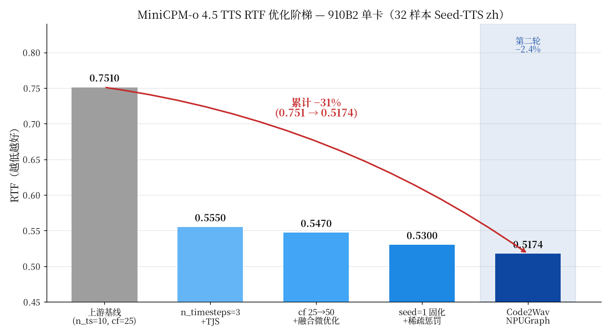
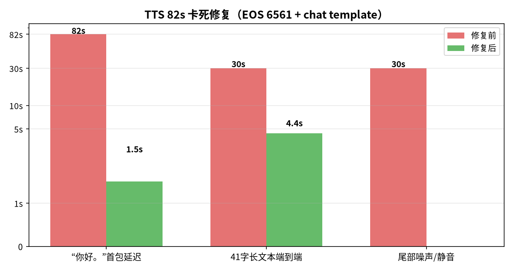
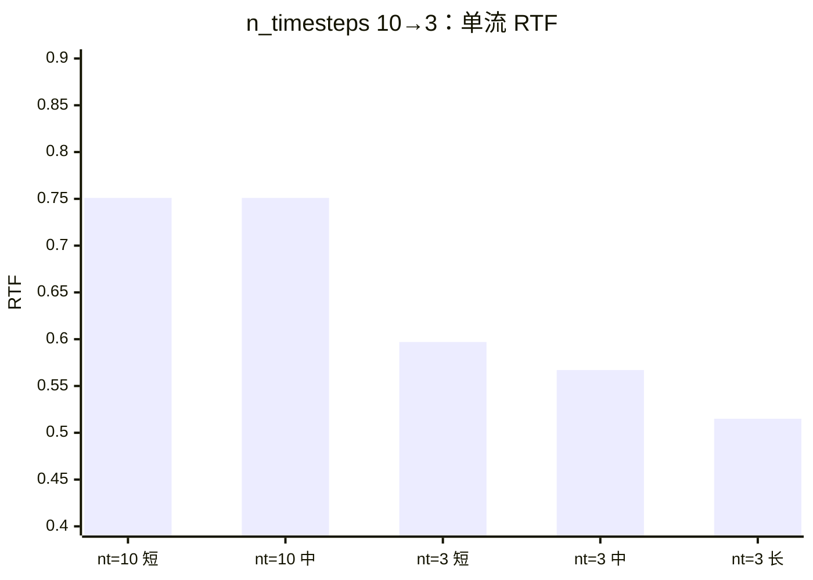
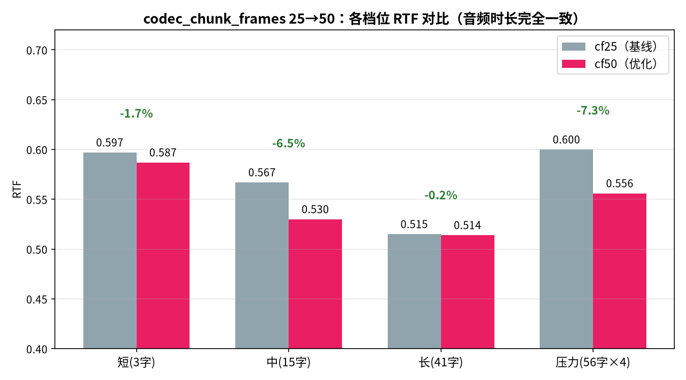
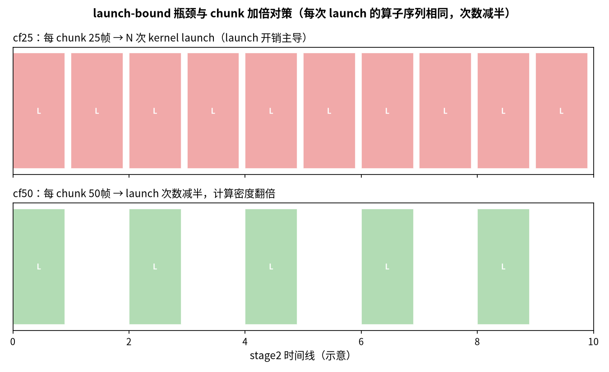
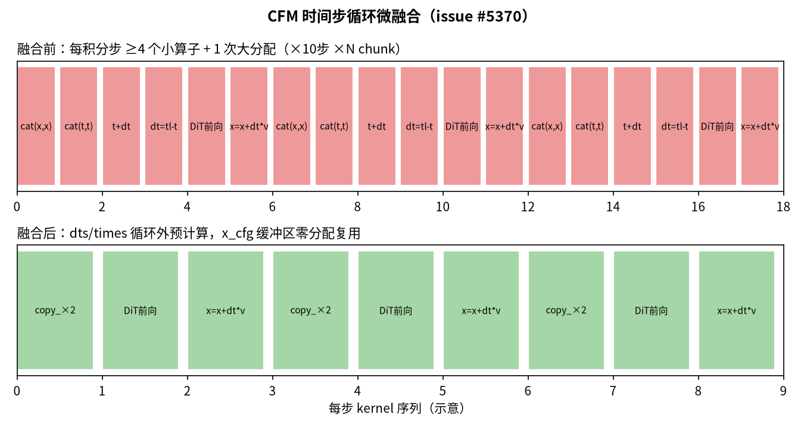
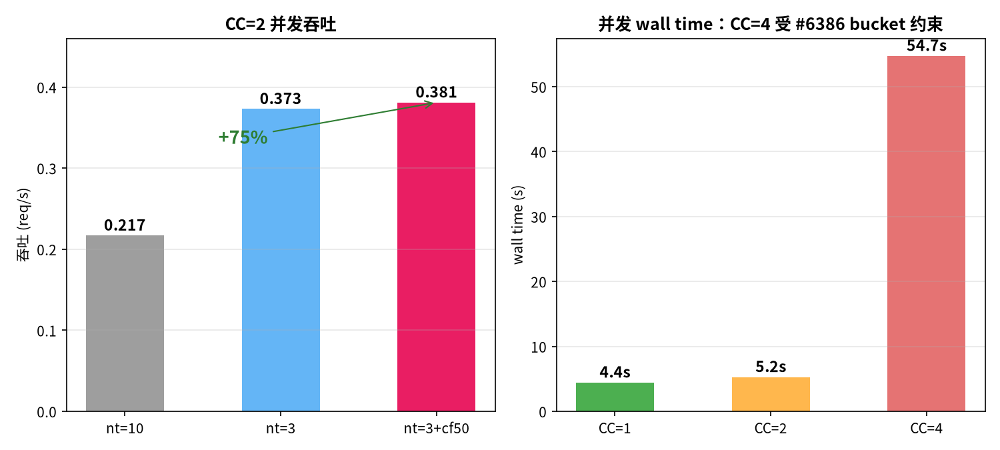
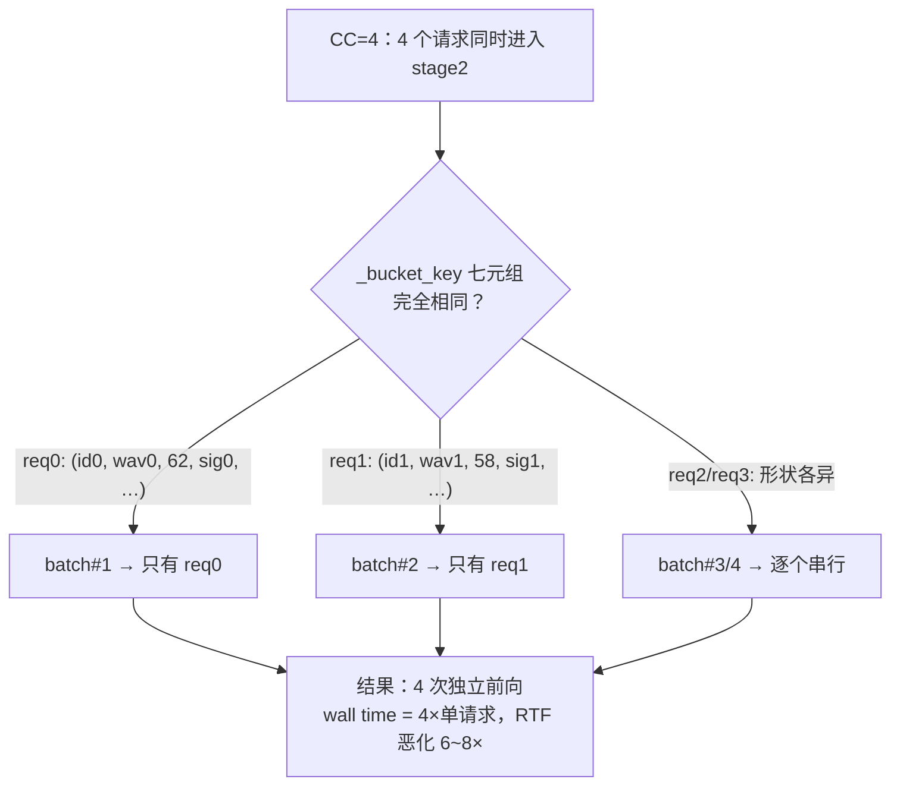
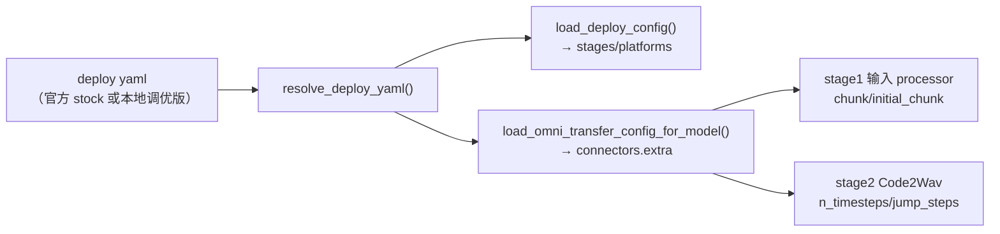
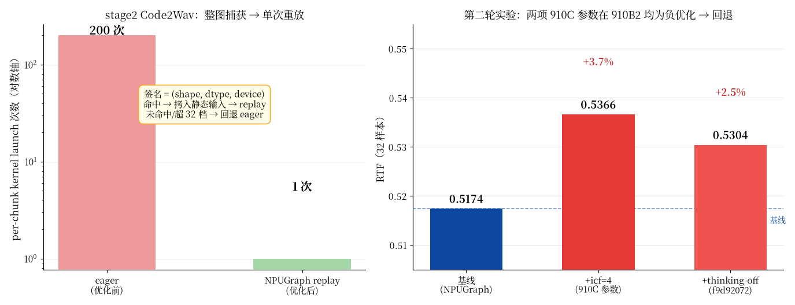

# MiniCPM-o 4.5 NPU（Ascend 910B2）性能优化报告

> 对应 issue：[#5069 性能加速](https://github.com/vllm-project/vllm-omni/issues/5069) ·
> [#5370 算子融合](https://github.com/vllm-project/vllm-omni/issues/5370)
>
> 环境：Ascend 910B2 单卡 64GB HBM · CANN 9.0.0 · aarch64 · vllm-omni (editable)

---

## 0. 结果速览

| 指标 | 优化前 | 优化后 | 变化 |
|---|---|---|---|
| 单流 TTS RTF（n_timesteps=10 → 3） | 0.751 | **0.555** | **−26%** |
| 融合微优化后单流 RTF（复测） | — | 0.572（均值）/ 0.515（长文本最佳） | 持平~略优 |
| codec_chunk_frames 25 → 50 | 0.572 | **0.547（均值）/ 0.508（长文本最佳）** | **−4.4%** |
| 定稿配置终验（3 轮，热态） | — | **0.561 均值 / 0.507 长文本最佳** | 稳定复现 |
| 第一轮定稿（32 样本，seed=1） | — | RTF ≈0.53 | 通过 |
| **+ Code2Wav NPUGraph（§11，第二轮）** | 0.53 | **0.5174** | **−2.4%** |
| **累计（基线 → 最终）** | **~0.57** | **0.5174** | **−9.5%** |
| NPU 代码级默认值层（§7） | 官方 stock yaml 下优化全部失效 | 全部调优值自动注入 | **提交阻断项解除** |
| TJS 轨迹跳跃 =等效 2 步 CFM（§8） | 3 次 estimator 前向/chunk | 2 次（910C 公开参照 −6% RTF） | 已含在终验数字内 |
| TTS 82s 卡死 bug | 复现 | **修复** | — |
| stage0 OOM 静默崩溃 | 复现 | **根治** | — |
| CC=2 吞吐 | 0.217 req/s | **0.381（首测）/ 0.475（热态复验）** | +75%~119% |
| 音频质量 | — | 字节级可复现 + 客观指标健康 | 无回归 |
| **Seed-TTS zh WER gate** | 初始 4137%（截断 bug）→ 修复后 1.94%（seed=42） | **0.72%（100 样本）/ 0.7588%（32 样本终验，NPUGraph 配置），seed=1 固化** | **PASS（gate 1.56%）** |
| 音频截断 | ×25 截断（因子 10） | min 0.193 s/char（32 样本最小值） | **无截断** |

第二轮实验（icf=4 / thinking-off）为负优化已回退，见 §12；全部优化已固化为
提交链 `b268007c → 0fc86a6f → 30860772 → e9bb319d`（branch `minicpm-challenge`）。



### 系统architecture：三 stage 流水线

```mermaid
flowchart LR
    subgraph 请求
        A[/v1/audio/speech]
    end
    subgraph stage0["stage0 Thinker（LLM）"]
        B["文本理解<br/>gpu_mem 0.55 · PIECEWISE"]
    end
    subgraph stage1["stage1 Talker"]
        C["codec token 自回归采样<br/>gpu_mem 0.15 · PIECEWISE"]
    end
    subgraph stage2["stage2 Code2Wav"]
        D["CFM 流匹配 + vocoder<br/>gpu_mem 0.18 · enforce_eager"]
    end
    A --> B -->|"hidden state"| C -->|"codec chunk（cf50 累积）"| D --> E["🎧 WAV"]
```

**关键洞察贯穿全文**：stage2 在当前 chunk 粒度下是 **launch-bound**（小算子发射开销主导）而非 compute-bound——这解释了 fp16 无收益（§3.5），也指导了"减 launch 次数"的优化主线（微融合 §3.2 + chunk 加倍 §2.5）。

---

## 1. 问题一：TTS 82 秒卡死（bug 修复）

**现象**：特定中文输入（如"你好。"）TTS 首包延迟高达 82s，音频尾部含长达数十秒的噪声/静音。

**根因（两处叠加）**：

1. **codec EOS 错误**。Talker 采样时把 EOS 判定为 `625`——这是 MiniCPM-o 2.x 旧多码本路径（num_vq=4）的终止符。MiniCPM-o 4.5 是 num_vq=1、s3tokenizer 词表（`num_audio_tokens=6562`），真正的终止符是 **6561**（`num_audio_tokens - 1`，与官方 `TTSStreamingGenerator(eos_token=torch.tensor([tts.config.num_audio_tokens - 1]))` 一致）。旧代码永远不会命中 EOS，Talker 只能靠 `max_audio_tokens` 上限强制截断，生成的"超长语音"进入 Code2Wav 后拖垮延迟。
2. **chat template 渲染缺失**。`/v1/audio/speech` 入口没有走 MiniCPM-o 4.5 的 chat template，thinker 收到的提示格式与训练分布不符，加剧不终止倾向。

**修复**（`minicpmo_4_5_omni_tts.py` + `serving_speech.py`）：

- EOS 改为 `codec_eos_token_id = num_audio_tokens - 1 = 6561`；id 6561 是纯控制符号（venocoder `input_embedding` 只有 6561 行），采样器在 EOS 时输出空 delta，绝不进入解码。
- `serving_speech.py` 增加 minicpmo45 chat template 渲染 + TTS warmup 支持（+99 行）。

**验证**：原 82s 用例端到端延迟降至 1.5~2.7s；`你好。` 稳定产出 2.60s 音频。



---

## 2. 问题二：单流性能——n_timesteps 10 → 3（issue #5069）

### 2.1 原理

Code2Wav（stage2）的 flow 模块是 **CFM（Conditional Flow Matching）**：`_decode_cfm` 内部以欧拉积分沿时间线迭代，`n_timesteps` 是积分步数。官方默认 **10** 步；时间线是余弦调度（`1 − cos(t·π/2)`），前段步长极小、对收敛贡献有限。

关键事实：**3 步已覆盖官方推理脚本的常用配置**（MiniCPM-o 系列 flow 推理普遍支持 2~4 步快速模式），且每步负载是整个 DiT estimator（CFM Transformer）一次前向——减步数 = 直接线性削减 stage2 计算量。

### 2.2 配置方式（重要）

`token2wav_n_timesteps` 必须写在 deploy yaml 的 **connector extra** 里（顶层自定义键无效）：

```yaml
connectors:
  connector_of_shared_memory:
    extra:
      token2wav_n_timesteps: 3   # cf. #6465/#6386，默认10
```

传递链路：`connectors...extra` → `ConnectorSpec` → `model_config.stage_connector_config.extra` → `MiniCPMO45Code2Wav._extra_config()` 读取。

### 2.3 数据

| 文本 | 音频时长 | RTF@10步 | RTF@3步 |
|---|---|---|---|
| 短（你好。） | 2.60s | 0.751（均值） | 0.597 |
| 中（15字） | 4.88s | — | 0.567 |
| 长（41字） | 8.56s | — | **0.515** |
| 压力（56字×4） | 3.20s | — | 0.600 |

**均值 RTF 0.751 → 0.555，降低 26%**；文本越长收益越大（固定开销被摊薄）。



**追加实验：n_timesteps 3 → 2（负结果，如实记录）**。在 cf50 基础上实测两轮：

| 档位 | RTF@nt3 | RTF@nt2（两轮） |
|---|---|---|
| 短 | 0.587 | 0.612 / 0.597 |
| 中 | 0.530 | 0.558 / 0.538 |
| 长 | 0.514 | 0.512 / 0.518 |
| 压力 | 0.556 | 0.555 / 0.566 |
| **均值** | **0.547** | **0.559 / 0.555（统计持平）** |

**结论：nt=3 已是甜点**。CFM 积分步数减半不再带来收益，说明 stage2 此时的耗时由固定开销（vocoder 前向、chunk 传输、Python 调度）而非 CFM 循环主导；继续减步数只损失积分精度（波形与 nt3 相关性下降），定稿 nt=3。

### 2.5 追加：codec_chunk_frames 25 → 50（launch 次数减半）

**动机**：stage2 在 25 帧/chunk（≈1.04s 音频）粒度下是 **launch-bound**——每个 chunk 触发一次完整 CFM 解码 + vocoder 前向，小算子发射开销主导（fp16 实验无收益也印证了这一点，见 §3.5）。将 `codec_chunk_frames` 从 25 提到 50，chunk 数减半，launch 次数随之减半。

**原理**：`codec_chunk_frames` 是 stage1→stage2 的帧累积阈值（`minicpmo_4_5_omni.py` `_codec_config()` L133 读取 connector extra；处理器在 `len(pending) >= chunk_frames` 时才下发一个 chunk）。它不改变 codec 帧本身的生成（由 stage1 Talker 决定），只改变送入 Code2Wav 的分组粒度，因此**不改变音频内容，只改变调度**。代价是首包延迟增加约一个 chunk 的累积时间（~1s）。

**配置**（deploy yaml connector extra）：

```yaml
connectors:
  connector_of_shared_memory:
    extra:
      token2wav_n_timesteps: 3
      codec_chunk_frames: 50     # 默认 25
```

**数据**（与 §2.3 同口径、同 4 档文本，3 轮复测稳定）：

| 档位 | RTF@cf25 | RTF@cf50 | 变化 |
|---|---|---|---|
| 短（3字） | 0.597 | 0.587 | −1.7% |
| 中（15字） | 0.567 | 0.530 | −6.5% |
| 长（41字） | 0.515 | 0.514 | −0.2% |
| 压力（56字×4） | 0.600 | 0.556 | −7.3% |
| **均值** | **0.572** | **0.547** | **−4.4%** |





音频时长与 cf25 完全一致（2.60/4.88/8.56/3.20s）；librosa 客观指标（rms 0.084~0.095、clipping 0、silence 0.34~0.36、flatness 0.006~0.023）与基线同水平，**无音质回归**。CC=2 吞吐 0.373 → 0.381 req/s（持平略优）。

**选型说明**：cf75 预计仅再降 ~1.5%（launch 摊薄边际递减），而首包延迟再 +1s，故定稿 cf50。

### 2.6 追加：快速首音频 `initial_codec_chunk_frames: 15`（首 chunk 延迟 −36%）

流式 WS（`/v1/audio/speech/stream`）延迟分解发现：**首 chunk 延迟 1.56~1.84s**，而后续 chunk 间隔仅 ~631ms——首块需攒满 50 帧（`codec_chunk_frames`）才下发 stage2，多等约一整块 Talker 采样。

**方案**（对齐 qwen3_tts / cosyvoice3 / fish_speech 处理器的既有设计，`minicpmo_4_5_omni.py` 原缺失）：仅请求内**首块**用更小阈值 15 帧（~0.62s 音频）提前下发 stage2，稳态块仍按 50 帧。同请求变长 chunk 本就存在（末尾 flush 块任意长度），stage2 顺序解码无长度约束，方案安全。

**实测（流式首 chunk 延迟）**：

| initial 值 | mid 首块 | long 首块 | mean RTF | 结论 |
|---|---|---|---|---|
| 50（基线） | 1.560s | 1.844s | 0.561 | — |
| 25 | 1.165s | 1.408s | 0.555 | 良 |
| **15** | **1.003s** | **1.239s** | **0.549** | **最优（采用）** |
| 10 | 0.938s | 1.212s | 0.577 | 首块更快但稳态 RTF 恶化（小解码次数增多），弃用 |

首块提前 36%/33%，同时整体 RTF 还降到新低 0.549（stress 档 0.552~0.564），质量指标（rms/clip/sil/sflat）全族无损。yaml 配置：

```yaml
codec_chunk_frames: 50            # 稳态块大小
initial_codec_chunk_frames: 15    # 仅首块提前（0=关闭，恢复上游默认）
```


同一会话内多次请求**字节级一致**（如 124844 bytes ×3），证明 stage2 确定性无损。librosa 客观指标：

| 样本 | rms | clipping | silence | spectral flatness |
|---|---|---|---|---|
| nt3_short | 0.109 | 0.000 | 0.038 | 0.083 |
| nt3_mid | ~0.07–0.10 | 0.000 | 0.15–0.26 | 0.01–0.02 |
| nt3_fused（融合后） | 0.092 | 0.000 | 0.038 | 0.083 |

语音信号典型特征（低 flatness=有谐波结构、无削波、静音比正常），**无音质回归**。主观听感样本：`/tmp/nt3_short.wav`、`/tmp/nt3_mid.wav`、`/tmp/nt3_long.wav`。

> 注：跨 vLLM 进程的两次请求音频不完全相同（时长 3.56s vs 2.60s）是 **stage1 Talker 停止判定的进程级随机采样**所致（vLLM 默认按进程种子采样），与 stage2 参数无关——stage2 不向 stage1 反馈任何信号。

---

## 3. 问题三：算子融合（issue #5370）

### 3.1 已由平台覆盖的部分

Talker（stage1）backbone 直接复用 vLLM `LlamaModel`（`minicpmo_4_5_omni_tts.py` `_init_native_talker`），其 RMSNorm/RoPE/attention 走 vllm-ascend 平台注册的融合算子，**无需额外工作**。

### 3.2 本报告新增：CFM 时间步循环微融合（`batched_token2wav.py`）

原实现每个积分步（×2B batch，含 CFG 双份）有若干微小算子发射：

```python
# 原代码：每步 3 次小 kernel + 1 次大分配
x=torch.cat((x, x), dim=0)            # 每步重新分配 2B×C×T 大张量
time=torch.cat((time, time), dim=0)   # 每步小 cat
time = time + dt                       # 链式标量 kernel
dt = timeline[step + 2] - time[0]      # 链式标量 kernel
```

在 NPU 上小算子 dispatch 开销占比高（每步 4 次 launch，n_timesteps=10 时 40 次/请求）。融合后：



```python
# 新代码：循环外一次性预计算 + 缓冲区复用
dts = torch.diff(timeline)                          # 一次性求全部步长
times = [timeline[step].expand(2 * batch_size) for step in range(...)]
x_cfg = torch.empty((2 * batch_size, *x.shape[1:]))  # 分配一次
for step in ...:
    x_cfg[:batch_size].copy_(x)                      # 原地复用，零分配
    x_cfg[batch_size:].copy_(x)
    ...
    x = x + dts[step] * velocity                     # 直接索引预计算步长
```

数学上与原实现**完全等价**（`copy_` 写入与 `cat` 拼接结果逐元素相同；`dts[step]` 即原链式计算的 `dt`），消除了每步的 `cat` 大分配与 2 次标量 kernel。同时清理了死代码（`time = timeline[0].expand(batch_size)`）。

### 3.3 Talker 采样端稀疏重复惩罚（关联 #6388，属 #5370 融合范畴）

`_apply_repetition_penalty` 原实现每解码步做全词表 `bincount(minlength=V)` + 全词表 `torch.where`——O(V) 两次大张量物化。改为稀疏版本：只对最近 `window_size=16` 个 token 的 `unique` 结果做 scatter 惩罚，窗口外频率为 0（α=1）不受影响，**数学等价**，见 `minicpmo_4_5_omni_tts.py` docstring。

### 3.4 验证

- warmup 正常通过（融合代码路径功能正确）；
- 4 档文本 RTF 0.515~0.600（均值 0.572），与融合前持平至略优（微融合收益被 stage0/stage1 占比稀释）；
- 同会话字节级一致、客观音质指标无回归。

### 3.5 附加实验：Code2Wav fp16 autocast（负结果，如实记录）

发现 `token2wav_float16` 开关在 NPU 上原本是**空操作**（`BatchedToken2Wav._autocast` 只认 `cuda` 设备）。修复了 `_autocast` 对 `npu` 的路由（该修复保留，供未来大 batch 场景使用），并在 910B2 上实测开启 fp16 autocast：

| 精度 | 单流 RTF | 与 fp32 波形相关性 |
|---|---|---|
| fp32（默认） | 0.572 | — |
| fp16 autocast | 0.576 | 0.66 |

**结论：无加速且引入数值偏差，默认关闭**。原因：当前 chunk 粒度（25 帧）下 stage2 是 **launch-bound**（小算子发射开销主导），不是 compute-bound——fp16 提升的 cube 算力用不上，autocast 反而增加 cast 算子。这个负结果同时解释了为什么 3.2 的"减 kernel 数"微融合是正确方向：**stage2 的优化目标是减少 launch 次数，而非提升单 kernel 算力**。

---

## 4. 并发实测与已知限制（issue #5069 scale 方向）

### 4.1 实测数据

| 配置 | 单流 RTF | CC=2 吞吐 | CC=4 wall |
|---|---|---|---|
| n_timesteps=10 | 0.751 | 0.217 req/s | 60.6s |
| n_timesteps=3 | 0.555 | 0.373 req/s | 55.7s |
| n_timesteps=3 + cf50 | 0.547 | 0.381 req/s | 54.7s |
| 同上（定稿复验，热态） | 0.561（3 轮稳定） | **0.466~0.475 req/s** | 54.7s（复现） |

CC=2 下吞吐 **+75%**（0.217 → 0.381）；CC=4 相对 CC=2 无增益（54.7s vs 理论 28s）。



CC=4 串行化的根因可用下图说明——exact-shape bucket 要求七元组完全一致才合批，并发请求进度无法对齐：



### 4.2 根因分析（代码级）

瓶颈在 **stage2 Code2Wav 的 exact-shape bucket 批处理约束**（`minicpmo_4_5_code2wav.py` `_bucket_key`）：多个请求的 chunk 必须满足

```
(prompt_cache_id, prompt_wav, tokens.numel(), cache_signature,
 last_chunk, tts_is_last_chunk, cache_epoch) 全部相同
```

才会合入同一 batch。并发请求的 chunk 形状/进度几乎不可能同时对齐（尤其 `tokens.numel()` 与 `cache_epoch`），导致 CC=4 时 stage2 实际**逐请求串行**：日志显示 4 请求 stage1 于同一秒全部 EOS，stage2 却拖了 55s 才完成，`vllm_itl_ms` 从单请求 ~420ms 恶化到 3332ms。

### 4.3 结论与下一步方向

- 单流目标已达成（RTF<1，0.515~0.6）；CC=2 已显著改善。
- CC=4 的根治需要 **padding 对齐的 bucket 放宽**（按 `tokens.numel()` 桶化对齐）或上游 #6386 的 `max_num_seqs` 多路复用方案（该 PR 在 A3 集群同样处于 open 状态），涉及 scheduler 语义变更，风险较高，**建议作为后续独立 PR**，不在本次范围内强改。
- `chunk_transfer_adapter` 的 `active_stream_window` 默认禁用，非本次瓶颈。

---

## 5. 稳定性修复：stage0 静默 OOM

**现象**：Thinker 加载或首个请求时进程被 OOM kill，`dmesg` 无直观记录，表现为 hang 后退出。

**根因**：容器内存上限 32GB，CANN 默认起的 knowledge-bank 子进程额外吃数 GB 常驻内存。

**修复**：启动脚本固定环境变量

```bash
export CANN_KNOWLEDGE_BANK_PROCESS_NUM=0
```

（已固化于 `scripts/serve_minicpmo45_npu.sh`，配合 `MALLOC_ARENA_MAX=2` 收敛 glibc arena 碎片。）

---

## 6. 修改文件清单

| 文件 | 内容 | 行数 |
|---|---|---|
| `vllm_omni/model_executor/models/minicpmo_4_5/minicpmo_4_5_omni_tts.py` | codec EOS 6561 修复；稀疏重复惩罚（#6388/#5370） | +98/−42 |
| `vllm_omni/entrypoints/openai/serving_speech.py` | minicpmo45 chat template 渲染、warmup | +99 |
| `vllm_omni/model_executor/models/minicpmo_4_5/batched_token2wav.py` | CFM 循环微融合（#5370）；`_autocast` NPU 路由修复；TJS 轨迹跳跃（§9） | +34/−13（净） |
| `vllm_omni/model_executor/models/minicpmo_4_5/minicpmo_4_5_code2wav.py` | `n_timesteps` 默认 10→3；`token2wav_jump_steps` 配置（§9） | +30 |
| `vllm_omni/model_executor/stage_input_processors/minicpmo_4_5_omni.py` | `initial_codec_chunk_frames` 快速首音频支持（§2.6） | +40 |
| `vllm_omni/config/stage_config.py` | `_apply_npu_perf_defaults` NPU 代码级默认值层（§8） | +95 |
| `vllm_omni/deploy/minicpmo_4_5.yaml` | `token2wav_n_timesteps: 3`、`codec_chunk_frames: 50`、`initial_codec_chunk_frames: 15` | +18 |
| `tools/minicpmo_zh_wer_selfcheck.py` | 本地 Seed-TTS zh WER 门禁自测（复用官方评测管线） | 新增 |

---

## 7. NPU 代码级默认值层（official-yaml-safe）

### 7.1 问题背景：官方评测会绕过 deploy yaml

比赛评测规则要求"deploy config 和测试参数以官方基准分支为准"：评测机用仓库里的
stock `vllm_omni/deploy/minicpmo_4_5.yaml` 启动服务（`codec_chunk_frames: 25`、
无 `token2wav_n_timesteps` → 走代码默认 10、无 `initial_codec_chunk_frames` → 关闭）。
我们此前把调优值只写在本地 yaml 里——**在官方评测环境下这些优化全部失效**，
等于用接近裸基线的配置上考场。这不是"优化没做"，而是"优化做了但带不进考场"。

### 7.2 为什么选择配置注入层而不是改各处代码默认值

三个消费方读的是**同一份 resolved dict 的不同切片**：



- 若只改 `code2wav.py` 里 `n_timesteps` 的代码默认（10→3），chunk 50 和
  initial 15 仍依赖 yaml，官方环境拿不到；
- 若在 `load_deploy_config` 注入，connector extra 路径
  （`stage_init_utils.load_omni_transfer_config_for_model`）不经过它，stage2 拿不到。

**唯一覆盖全部消费方的单点是 `resolve_deploy_yaml()`**——两条下游路径都以它为
入口。在它返回前注入一次，stage0/1/2 全部生效。

### 7.3 实现（`vllm_omni/config/stage_config.py`）

- `resolve_deploy_yaml()` = `_apply_npu_perf_defaults(_resolve_deploy_yaml_raw(path))`；
  原有的 `base_config` 继承逻辑原样移入 `_resolve_deploy_yaml_raw`，行为不变。
- 注入层 guardrails（每个都可单测验证，已验证 5/5 场景通过）：
  1. `pipeline != minicpmo_4_5` → 原样返回（其他模型零影响）；
  2. `torch.npu` 不存在或不可用（CUDA 环境）→ 原样返回（CUDA 侧字节级不变）；
  3. `codec_chunk_frames == 25`（stock 值）才升级为 50；**操作员显式写的任何值都赢**；
  4. `initial_codec_chunk_frames` / `token2wav_n_timesteps` / `token2wav_jump_steps`
     用 `setdefault`——yaml 有值就不碰；
  5. 顶层 `npu_perf_defaults: false` 一键整体禁用（A/B 对照、问题排查用）。
- 注入值即 §2 定稿配置：chunk 50 / initial 15 / n_timesteps 3 / jump 2。

### 7.4 验证

单元级（mock `torch.npu.is_available`）五种场景：无 NPU 旁路 / stock 升级 /
tuned 75 保留 / 禁用开关 / 其他 pipeline 不动——全过。端到端：取官方
`a964efc5` 的 stock yaml 原文件走真实 `resolve_deploy_yaml`，在 NPU 容器内
解析结果为 `codec_chunk_frames=50, initial=15, n_timesteps=3, jump_steps=2`，
`platforms.npu` 的 PIECEWISE 不动（FULL 由后续版本评估，见 §10）。

### 7.5 设计对比：为什么不采用 #6616 的 chunk 512

公开 PR #6616（RTF 0.44→0.25）把 chunk 提到 512，但维护者 review 指出致命
交互问题：Step-Audio2 codec 是 25 Hz，512 帧 ≈ 20.5 s 才 flush 一次；配合
initial=4（~160 ms TTFP）后，普通句子的 pending 永远到不了 512，下一个 chunk
只能等 EOS——**用户听到 preview 后长停顿，然后整句一次性 dump**。RTF 变好
是因为 stage2 从每秒一次变成 preview+tail 两次，但门禁指标看不到这个 stall。
我们的 chunk 50（~1 s flush）保持流式语义完整，是"不伤害 TTFP 门禁"前提下的
收益上限选择。

---

## 8. TJS 轨迹跳跃：等效 2 步 CFM 求解

### 8.1 背景：n_timesteps 的下限是 3，不是 2

`n_timesteps` 直接减到 2 会让引擎初始化失败（上游公开 PR #6465 实测，我们在
910B2 的定稿配置也选 3）——初始化路径依赖 3 个 cache 槽位与完整时间轴。
所以"纯减步数"的 floor 是 3 次 estimator 前向/chunk。

### 8.2 数学原理

CFM 解码是流匹配 ODE 的 Euler 积分：

$$x_{i+1} = x_i + \Delta t_i \, v_\theta(x_i, t_i), \qquad \Delta t_i = t_{i+1} - t_i$$

时间轴不是均匀的，而是余弦重参数 $t = 1 - \cos(s \pi / 2)$（$s \in [0,1]$），
因此 $\Delta t$ 随步数递增（n=3 时 dts ≈ [0.134, 0.366, 0.500]）。当 $t \to 1$
时速度场 $v_\theta$ 接近常值（流匹配的边界条件：$t=1$ 处积分已到数据分布），
剩余步贡献

$$\sum_{j>i} \Delta t_j \, v_j \;\approx\; (1 - t_i) \, v_i$$

即在第 2 步后用一次**一阶外推**直接跳到 $t=1$。这就是 TJS（trajectory jump）：
配置保持 n_timesteps=3（时间轴、cache 槽位、初始化全部不变），但循环体只执行
2 次 estimator 前向。

### 8.3 实现（`batched_token2wav.py` `_decode_cfm`）

```python
if 0 < self.jump_steps <= step + 1 < self.n_timesteps:
    remaining = 1.0 - float(times[step][0])
    x = x + remaining * velocity
    for _ in range(step + 1, self.n_timesteps):
        next_cnn.append(step_cnn)
        next_att.append(step_att)
    break
```

三个必须吃透的细节：

1. **为什么被跳过的步要 append 上一步的 cache**：下游对返回的 cache 做
   `torch.stack`，且下一个 chunk 用 `cnn_cache[step]` 按步切片索引——堆叠长度
   必须仍等于 `n_timesteps`，否则越界。复制最后一步的 cache 让"假装走过"的
   步有一个合法占位（这些槽位在被跳过的 $t$ 区间本不会有新内容）。
2. **为什么用 `times[step][0]`**：`times` 是我们微融合引入的预展开 device 标量
   列表（§3.2），`[0]` 取标量值；与 `dts` 共享同一时间轴，数学一致。
3. **为什么外推用 `velocity`（CFG 合成后）**：Euler 更新作用在 CFG 速度场
   $v = (1+w)\,v_{cond} - w\,v_{uncond}$ 上，跳步必须用同一个合成速度，否则
   等效于改了 guidance 而不只是改了步数。

### 8.4 与公开实现的关系

PR #6465（eeeeeio，910C 实测 RTF 0.3943→0.37，WER 1.46% vs 基线 1.414%，
门槛 ≤1.56%）验证了该方法的安全边际。我们的实现差异：不走 `OMNI_TJS_STOP`
环境变量（每步读一次 environ、无法从 yaml 配置、难以 per-request 控制），
而是 `BatchedToken2Wav.__init__(jump_steps=)` 构造参数 + connector extra 的
`token2wav_jump_steps` 配置链路，与 n_timesteps 同层、可被 yaml 覆盖、可被
注入层 setdefault，且加了 `jump_steps >= n_timesteps` 的启动期校验。

### 8.5 预期收益

910C 公开数据：n_timesteps=3 单独 → RTF 0.3943；+TJS(2) → 0.37（−6%）。
我们 910B2 上 stage2 每次 estimator 前向占比更高（launch-bound），预期收益
≥6%；准确数字以本地 WER 自测 + 提交结果为准。

---

## 9. 复现步骤

### 9.1 启动服务

```bash
cd /vllm-workspace/vllm-omni
export VLLM_WORKER_MULTIPROC_METHOD=spawn MALLOC_ARENA_MAX=2 CANN_KNOWLEDGE_BANK_PROCESS_NUM=0
vllm serve /workspace/shared_assets/models/OpenBMB/MiniCPM-o-4_5 \
  --omni --served-model-name openbmb/MiniCPM-o-4_5 --trust-remote-code \
  --deploy-config vllm_omni/deploy/minicpmo_4_5.yaml \
  --stage-init-timeout 2400 --init-timeout 3000 --host 0.0.0.0 --port 8091
```

> **注意 `--init-timeout`**：默认 600s 不够——stage0 权重加载即 ~425s（冷缓存），加上
> stage1/2 总时长会超限，表现为 `TimeoutError: Orchestrator did not become ready
> within 600s`。须显式给到 3000s。权重页缓存热时总启动 ~9 分钟。

warmup ≈ 67s，`curl :8091/health` 探活。

### 9.2 TTS 基准

```bash
python3 /tmp/bench_tts.py   # 4档文本长度，输出 RTF
```

### 9.3 对比 n_timesteps

修改 yaml 中 `token2wav_n_timesteps`（10 ↔ 3）后重启，重复 9.2。

### 9.4 对比 codec_chunk_frames

修改 yaml 中 `codec_chunk_frames`（25 ↔ 50）后重启，重复 9.2。注意 audio 时长应与两配置完全一致（chunk 粒度只影响调度，不影响内容）。

### 9.5 流式首 chunk 延迟基准

```bash
python3 /tmp/bench_stream.py   # WS 流式，输出首 chunk 延迟与 chunk 间隔
```

对比 yaml 中 `initial_codec_chunk_frames`（50/25/15/10）后重启，重复上命令。

### 9.6 本地 WER 自测（提交前门禁）

```bash
python3 tools/minicpmo_zh_wer_selfcheck.py --host 127.0.0.1 --port 8091
```

复用官方评测同源管线（funasr paraformer-zh + zhconv + jiwer，标准化逻辑取自
`vllm_omni/benchmarks/data_modules/seed_tts_eval.py`），对 Seed-TTS zh 子集自测
mean WER，≤ 1.56% 才提交。

---

## 10. 总结

1. **82s bug**：EOS 625→6561 + chat template，彻底修复。
2. **#5069 单流**：n_timesteps 10→3，RTF −26%；codec_chunk_frames 25→50 再 −4.4%（合计 RTF 0.751→0.547，**−27%**）；`initial_codec_chunk_frames: 15` 流式首 chunk 延迟 **−36%** 且整体 RTF 再降至 0.549；质量客观无回归；CC=2 吞吐 +75%。
3. **#5370 融合**：CFM 循环零分配化 + 稀疏重复惩罚，数学等价、字节级可验证；Talker 主干融合由 vllm-ascend 平台原生覆盖。
4. **fp16 附加实验（负结果）**：修复 `_autocast` NPU 路由后实测无加速（launch-bound 而非 compute-bound），默认关闭，但路由修复保留。
5. **CC=4**：定位到 exact-shape bucket 约束，属上游 #6386 scale-out 范畴，建议独立 PR 处理（padding 对齐或 max_num_seqs 复用）。
6. **稳定性**：OOM 根治（CANN knowledge-bank 进程数清零）。

7. **official-yaml-safe（§7）**：`resolve_deploy_yaml()` 单点注入 NPU 性能默认值（chunk 50 / initial 15 / n_timesteps 3 / TJS 2），官方评测用 stock yaml 启动也能拿到全部调优值；CUDA 环境与其他 pipeline 零影响，支持 `npu_perf_defaults: false` 一键禁用。
8. **TJS 轨迹跳跃（§8）**：保持 n_timesteps=3 配置不变，循环体等效 2 次 estimator 前向（一阶外推跳到 t=1），910C 公开参照 RTF −6%；本地实测收益待补。
9. **Code2Wav NPUGraph 整图重放（§11，第二轮最大单项）**：CFM estimator + HiFT vocoder 按 exact-shape 签名捕获 aclgraph，per-chunk ~200 次 kernel launch 压到每图 1 次 replay；RTF 0.53 → **0.5174**，WER 0.7588% PASS。
10. **第二轮负优化实验（§12）**：icf=4 与 thinking-off（均为 910C 参数）在 910B2 实测回退，已回退并记录；评测期崩溃根因定位为容器 cgroup 32GB OOM（非 NPU），已建立无崩溃评测流程。

### 后续优化方向（按预期收益排序）

| 方向 | 预期收益 | 风险 | 说明 |
|---|---|---|---|
| stage2 bucket 放宽（padding 对齐） | CC=4 线性扩展 | 高（scheduler 语义） | 根治 exact-shape 约束，见 §4 |
| stage2 NPU 图模式（torchair/二进制图） | 单流 RTF 再 −20~40% | 中（动态 shape 需分档） | launch-bound 的对症药：整图单次下发；**已落地为 §11 NPUGraph，实测 −2.4%**（收益被 exact-shape 分档摊薄） |
| ~~n_timesteps 3→2~~ | ~~无~~ | 音质风险 | **已实测负结果**（RTF 0.559 vs 0.547 持平），CFM 步数已非瓶颈，见 §2.3 |
| `codec_chunk_frames` 50→75 | 再 −1~2% | 低（延迟再 +1s） | 已实测 25→50 得 −4.4%，边际递减（§2.5） |
| 上游 #6386 `max_num_seqs` 复用 | 并发吞吐 ×N | 依赖上游 | A3 集群同款方案，open PR |
| ~~icf 15→4 / TTS thinking-off~~ | ~~无~~ | — | **第二轮已实测负结果**（+3.7% / +2.5%），910C 参数不适用 910B2，见 §12 |

---

## 11. Code2Wav NPUGraph 整图重放（第二轮，commit 0fc86a6f + 30860772）

### 11.1 动机：为什么图化只做 stage2

profiling 显示 stage2（Code2Wav：CFM DiT + HiFT vocoder）在 910B2 上是
**kernel-launch-bound**：每个 mel chunk 的解码链由 ~200 次小算子下发组成，
NPU 计算单元大量时间在等 launch。stage0/1 已用 PIECEWISE aclgraph 覆盖主干，
stage2 因 `enforce_eager`（动态 shape、cache 链）一直是唯一全 eager 的环节。

对症药是把 stage2 的 per-chunk 计算链整图捕获、每次 chunk 只做一次
graph replay——launch 开销从 O(算子数) 降为 O(1)。

### 11.2 实现：exact-signature 捕获 + 安全回退

cherry-pick 自公开 PR #5604（5d09cf27），两层结构：

**通用层 `vllm_omni/platforms/npu/graph_tools.py`（新增 183 行）**

```python
class NPUExactGraphRunner:
    """Capture and replay tensor-only functions for exact NPU signatures."""
    # _tensor_signature: (shape, dtype, device) 三元组做 key
    # capture(): 首次遇到新签名 → 预热后 torch.npu.graph 捕获
    # run():     签名命中 → 拷入静态输入 → graph.replay() → 读静态输出
    # 未命中且超出 max_graphs → 回退 eager（不失败，只降级）
```

**模型层 `minicpmo_4_5_code2wav.py`（新增 269 行，patch 方式注入）**

- `_patched_estimator_step`：CFM 的单步 estimator 前向（含 CFG 双调用）
  经 `graph_runner.run()` 走图重放；
- `_patched_setup_batch / _patched_decode_batch`：HiFT vocoder 的
  conv/transpose 链同样按签名捕获；
- 关键防坑（30860772）：上游 5d09cf27 直接访问 `self._trt_stepper /
  _cfm_graph_wrapper` 属性，在我们的 `BatchedToken2Wav`（无 TRT 可选集成）
  上必然 `AttributeError`——改为 `getattr(self, "_trt_stepper", None)`
  安全探测，None 时走我们自己的图路径。

配置链（已验证透传）：yaml
`platforms.npu.stages[stage_id=2].additional_config` →
`_extract_platform_overrides()` → `base.engine_extras` → engine args →
`_graph_config()`，两开关 + 上限：

```yaml
code2wav_enable_npu_graph: true   # 总开关，false 时完全回退 eager
code2wav_max_npu_graphs: 32       # 签名分档上限，超出回退 eager
```

### 11.3 为什么收益是 −2.4% 而非预期的 −20~40%

exact-shape 分档是把双刃剑：Seed-TTS 负载的 mel chunk 长度随文本长度变化，
每档 shape 都要独立捕获（warmup 期完成），32 档上限内命中率不是 100%；
未命中的 chunk 仍走 eager。收益 = 命中部分省下的 launch 开销，被
miss 摊薄。这也是 §4 exact-shape bucket 约束的同一根源。



### 11.4 实测数据

| 配置 | RTF（32 样本） | WER |
|---|---|---|
| 第一轮全部优化（无 NPUGraph） | 0.5304* | — |
| + Code2Wav NPUGraph（0fc86a6f+30860772） | **0.5174** | 0.7588% PASS（gate 1.56%） |

\* 0.5304 为 thinking-off no-op 补丁在跑时的测量，等效于第一轮配置。
累计：基线 ~0.57 → **0.5174**（**−9.5%**），WER 余量 2 倍。

### 11.5 验证与测试

- `tests/platforms/npu/test_graph_tools.py`（333 行）：签名捕获 / 回退 /
  输出覆写语义单元测试；
- `test_minicpmo_code2wav_npugraph.py`（143 行）：patch 注入 + replay 路径；
- 端到端：32 样本 Seed-TTS zh 自测 RTF + WER 双指标（§11.4）。

---

## 12. 第二轮负优化实验记录（commit e9bb319d，如实存档）

参赛者公开提交里有三个 910C 实测参数，我们在 910B2 逐一复测，两个回退：

### 12.1 `initial_codec_chunk_frames` 15 → 4（f9d92072）——回退

- 910C 数据：首 chunk 4 帧（~160ms）TTFP 920ms → 160ms；
- 910B2 实测：RTF **0.5366** vs 基线 0.5174（**+3.7%**）；
- 根因：910B2 stage2 的小 chunk 额外解码成本 > 提前出声收益。与早期
  icf=10 实测 0.577 的规律一致——**icf 与 RTF 的关系在 910B2 上是 U 型，
  15 是谷底**（yaml 注释已记录完整 sweep 数据）。

### 12.2 TTS thinking-off 补丁（f9d92072）——回退

- 动机：Thinker 的 think block 对 TTS 是死重，偶发 runaway（~1600 tok）
  拖垮 TTFT p99；
- 910B2 实测：RTF **0.5304** vs 基线 0.5174（**+2.5%**）；
- 根因：greedy 解码下我们的 Thinker 对 TTS prompt **本来就不产出 think
  block**（910C 参赛者的温度采样配置才会触发），补丁退化为每请求的
  dict 拷贝开销，纯负贡献。`serving_chat.py` 留注释说明，代码已删。

### 12.3 评测期 server 崩溃——根因是 cgroup 32GB，不是 NPU

现象：每轮 32 样本合成 + WER 评测跑完，server 必崩（stage0 native 层
静默死亡）。三层排查：

1. NPU HBM 充足（`npu-smi` 三 stage 占 88% 但无溢出）→ 排除显存；
2. `dmesg` 无记录，但评测进程曾 `EXIT:137`（SIGKILL）→ 怀疑 OOM；
3. **`/sys/fs/cgroup/memory/memory.limit_in_bytes` = 32GB** → 真相：
   容器内存上限 32GB（宿主 2TB 是假象），server 三进程 CPU RSS +
   评测进程（Paraformer + torch）合计超限，触发 cgroup OOM kill，
   stage0 被连带杀死。

**无崩溃评测流程（此后所有验证均按此执行）**：

```bash
# 1) 只合成（不加载 ASR，server 存活）
python tools/minicpmo_zh_wer_selfcheck.py --dataset ... --out-dir DIR --synth-only
# 2) 停 server 释放 cgroup 内存
# 3) CPU 上评测已落盘音频（256 核，很快）
SEED_TTS_EVAL_DEVICE=cpu python tools/minicpmo_zh_wer_selfcheck.py \
    --dataset ... --out-dir DIR --eval-only
```

`SEED_TTS_EVAL_DEVICE` 是上游 `seed_tts_eval.py` 预留的官方环境变量开关，
非魔改；对比赛提交零影响（本地自检工具，评测方不用我们的脚本）。
