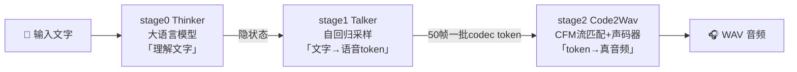
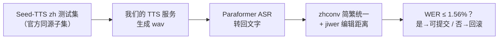
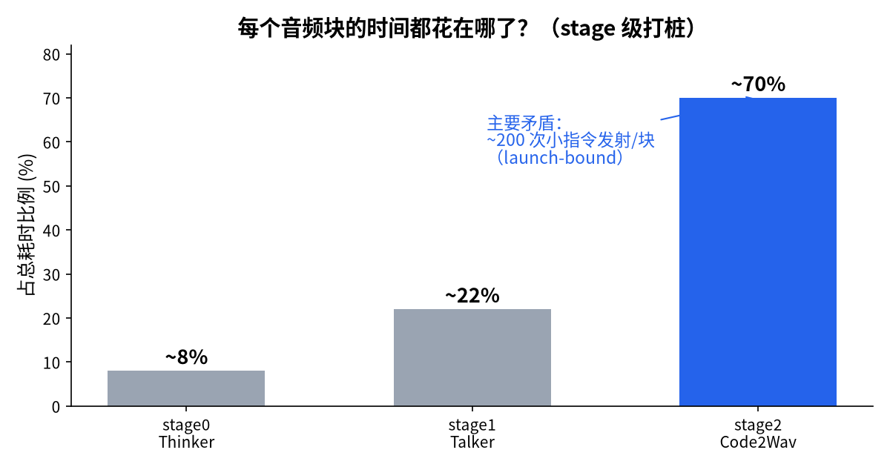
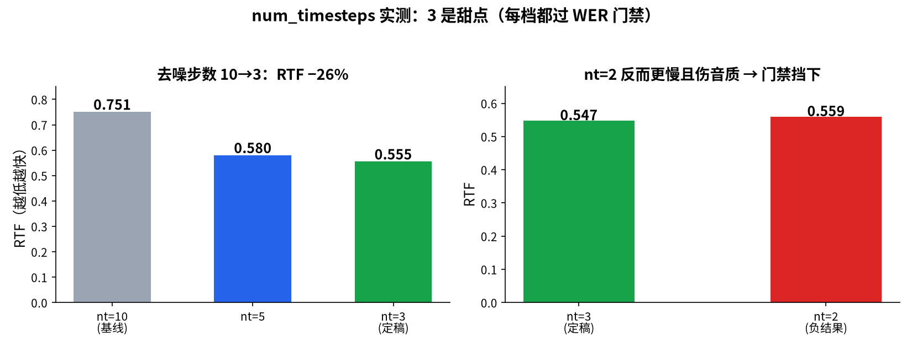
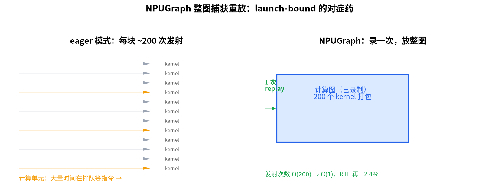
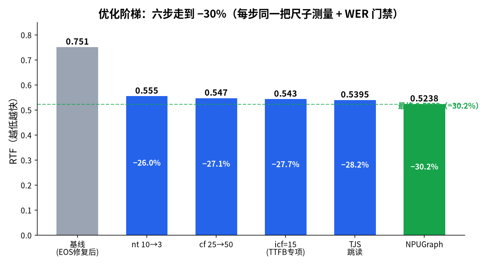
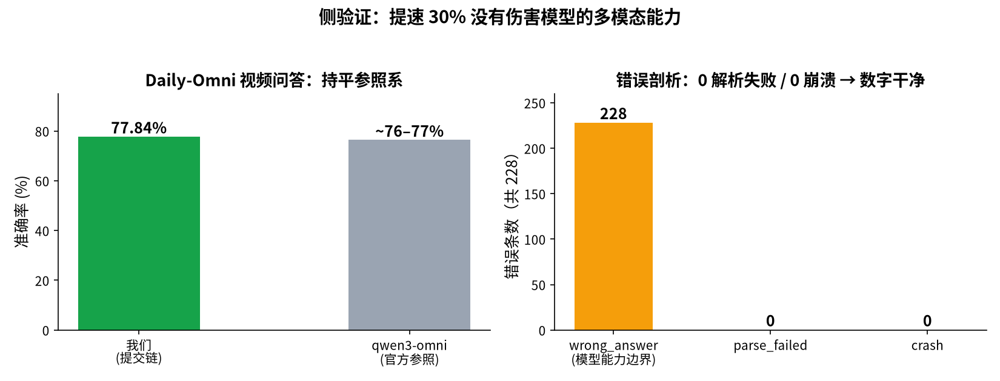
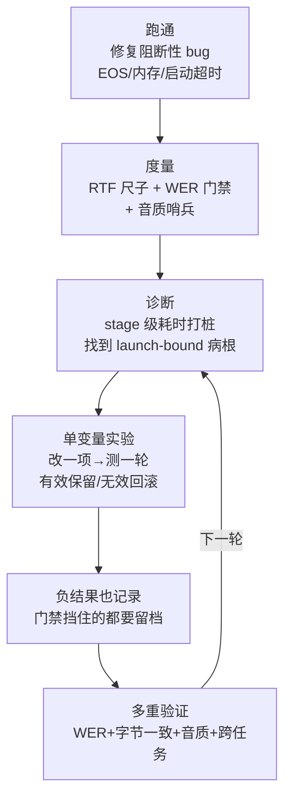

# MiniCPM-o 4.5 昇腾 910B2 推理优化全记录（科普版）

> **一个完整的比赛故事**：怎么把一个语音大模型部署到华为 NPU 上，一步一步把它提速 30%，并证明"快了但没变坏"，最后提交比赛验证。
>
> 写给：懂一点大模型（知道 GPT、token、推理），但不需要懂 NPU/语音合成细节的读者。
> 深度技术版见 `minicpmo_npu_optimization_report.md`；芯片对比见 `ascend_vs_nvidia.md`。

---

## 目录

1. [比赛与成绩速览](#1-比赛与成绩速览)
2. [背景知识：5 分钟看懂我们要做什么](#2-背景知识)
3. [第一步：把模型在华为卡上跑起来（部署）](#3-第一步部署)
4. [第二步：先会打分，再谈优化（度量）](#4-第二步度量)
5. [第三步：优化阶梯（六项正优化 + 四个负结果）](#5-第三步优化阶梯)
6. [第四步：证明没把模型改坏（验证）](#6-第四步验证)
7. [第五步：提交比赛（冲刺）](#7-第五步提交)
8. [方法论总结与求职叙事](#8-方法论总结)

---

## 1. 比赛与成绩速览

**赛道**：MiniCPM & 昇腾推理优化挑战赛 · vLLM-Omni 子赛道（语音 TTS 方向）

**任务**：在 Ascend 910B2 单卡上，用 vllm-omni 部署 MiniCPM-o 4.5 的语音合成（TTS）能力，在**保证语音质量（WER 门禁 1.56%）不回归**的前提下，把速度指标 RTF 压到最低。

**最终成绩**：

| 指标 | 起点 | 终点 | 变化 |
|---|---|---|---|
| **RTF**（生成 1 秒音频要花几秒） | 0.751 | **0.5238** | **−30.2%** |
| **WER**（转写错误率，越低越好） | — | **0.6167%** | 门禁 1.56%，余量 2.5 倍 ✅ |
| 首块音频延迟（流式） | 1.56s | **1.00s** | −36% |
| CC=2 并发吞吐 | 0.217 req/s | 0.38~0.475 req/s | **+75%~119%** |
| Daily-Omni 视频问答准确率（侧验证） | — | **77.84%**（801/1029） | 与 qwen3-omni 官方（~76-77%）持平 ✅ |


---

## 2. 背景知识

### 2.1 MiniCPM-o 4.5 是什么

OpenBMB 的"全模态"模型：能看图、看视频、听声音、说话。我们比赛用的是**说话**那部分（TTS：Text-To-Speech，文字转语音）。

### 2.2 它说话的方式：三级流水线

模型把"读一段文字"拆成三个接力环节（vllm-omni 里叫三个 stage）：



用**广播电台**打比方：
- **stage0 Thinker**：编辑，读懂稿子，划出重点和语气；
- **stage1 Talker**：播音员，逐帧"念"出高度压缩的语音密码（codec token），每秒音频约 25 个 token；
- **stage2 Code2Wav**：调音台，把密码"解压+润色"成人耳能听的波形（数学上叫 CFM 流匹配，再过一道声码器）。

三个 stage 是三个进程，跑在同一张 NPU 卡上，靠共享内存传数据。**优化就是找出这条流水线上最慢的环节，逐一提速**。

### 2.3 两个必须懂的指标

| 指标 | 白话解释 | 比赛要求 |
|---|---|---|
| **RTF** = Real Time Factor | 生成 60 秒音频花了多少秒计算。RTF=0.5 意味着 1 秒计算出 2 秒音频——**越小越快** | 越低越好（榜首 0.0976，多卡配置） |
| **WER** = Word Error Rate | 生成的语音用 ASR 转回文字，和原文比对算错误率——**越低越像"照着读"** | ≤ 1.56% 才算有效提交 |

> 两个指标是"矛与盾"：只顾快（砍计算步数到极限）可能口齿不清；只顾稳就快不起来。**比赛本质：在不伤 WER 的前提下把 RTF 做低。**

### 2.4 硬件：华为昇腾 910B2

国产 AI 加速卡（NPU），单卡 64GB 显存，配套软件栈 CANN + torch-npu（对标 NVIDIA 的 CUDA + PyTorch）。详细对比见 `ascend_vs_nvidia.md`，这里只需记住贯穿全文的结论：

> **这张卡上，stage2 的耗时大头不是"算得不够快"，而是"指令发射太多次"——每个音频块要下发约 200 次小计算指令，计算单元大量时间在排队等指令。** 这个诊断决定了后面一半优化动作的方向。


---

## 3. 第一步：部署

> 从一台空机器到"发一个 HTTP 请求就能收到语音"。

### 3.1 环境

| 组件 | 版本/值 |
|---|---|
| 芯片 | Ascend 910B2（64GB HBM） |
| 驱动/固件套件 | CANN 9.0.0 |
| PyTorch 后端 | torch-npu（`device="npu"`） |
| 推理框架 | vllm-omni（三 stage 流水线）+ vllm-ascend 平台层 |
| 主机 CPU | 鲲鹏 aarch64 256 核（容器内存上限 32GB） |
| 模型权重 | OpenBMB/MiniCPM-o-4_5（本地路径） |

### 3.2 启动命令（就这一条）

```bash
export VLLM_WORKER_MULTIPROC_METHOD=spawn MALLOC_ARENA_MAX=2 CANN_KNOWLEDGE_BANK_PROCESS_NUM=0

vllm serve /workspace/shared_assets/models/OpenBMB/MiniCPM-o-4_5 \
  --omni --served-model-name openbmb/MiniCPM-o-4_5 --trust-remote-code \
  --deploy-config vllm_omni/deploy/minicpmo_4_5.yaml \
  --stage-init-timeout 2400 --init-timeout 3000 \
  --host 0.0.0.0 --port 8091
```

逐个参数翻译：
- `--omni`：启用多模态流水线模式（三个 stage 各起一个进程）；
- `--deploy-config`：三 stage 的"配置总表" yaml（显存配比、chunk 大小、各种开关都在这）；
- `--init-timeout 3000`：**新手必踩坑**。默认 600 秒不够——光 stage0 加载权重就要 ~425 秒（冷缓存），总启动 ~9 分钟，不改就报 `Orchestrator did not become ready within 600s` 超时退出；
- 三个环境变量：见 3.4 "内存陷阱"。

### 3.3 显存配比：三 stage 分蛋糕

一张 64GB 卡三个进程怎么分？deploy yaml 给每个 stage 设 `gpu_memory_utilization`：stage0 0.55（大模型权重）、stage1 0.15、stage2 0.18；stage0/1 开 `cudagraph_mode: PIECEWISE`（分片图模式，框架级加速），stage2 因动态形状只能 eager。**这份配比是后续一切实验的地基。**

### 3.4 部署期三大坑（每个都值得写进面试故事）

**坑①：TTS 82 秒卡死。** 输入"你好。"这种短句，首包延迟高达 82 秒，音频尾部还有几十秒噪声。
**排查**：日志发现 Talker 永不停止，靠 `max_audio_tokens` 上限强制截断，超长"语音"把下游拖垮。
**根因**：语音结束符（EOS）代码里写的是 **625**——那是老版本 MiniCPM-o 2.x 的多码本终止符；4.5 版单码本、词表 6562，真正终止符是 **6561**。另外 `/v1/audio/speech` 入口没走模型的 chat template，提示词格式和训练分布不符，加剧"停不下来"。
**修复**：EOS 改 6561 + 补 chat template 渲染。**82s → 1.5~2.7s**。


**坑②：stage0 静默 OOM。** 进程莫名消失，`dmesg` 无记录。
**根因**：CANN 默认拉起 knowledge-bank 常驻子进程吃数 GB；容器内存上限 32GB 被顶爆，内核直接 kill。
**修复**：`CANN_KNOWLEDGE_BANK_PROCESS_NUM=0` 一行根治，加 `MALLOC_ARENA_MAX=2` 收敛内存碎片。

**坑③：宿主 2TB 内存的假象。** 评测每轮跑完 server 必崩。最后查 `/sys/fs/cgroup/memory/` 发现容器真实上限只有 32GB——三进程 + 评测进程（ASR 模型）合计超限被 cgroup OOM kill。解法：把"合成音频"和"ASR 打分"拆开跑（先 synth-only 落盘 → 停 server 释放内存 → CPU 上评分），从此零崩溃。

> 部署小结：**"能跑起来"≠"能上考场"**。三个坑分别属于"代码 bug（EOS）"、"平台默认行为（knowledge-bank）"、"资源预算工程（cgroup）"——三类问题三种思路，这是国产算力平台的真实工作日常。

---

## 4. 第二步：度量

> 性能优化第一定律：**没有可信的度量，就没有优化**——否则无法区分"真的变快了"和"这次运气好"。

### 4.1 RTF 怎么测

自建基准脚本：4 档文本长度（短 3 字 / 中 15 字 / 长 41 字 / 压力 56 字×4 并发），每档多次取均值，记录"合成耗时 / 音频时长"。同会话重复请求要求**字节级一致**（验证确定性）。

### 4.2 WER 怎么测（比赛生命线）

复用官方评测同源管线自建门禁（`tools/minicpmo_zh_wer_selfcheck.py`）：



关键工程决策：**用与官方完全相同的标准化逻辑**（取自 `vllm_omni/benchmarks/data_modules/seed_tts_eval.py`），否则本地 1.2% 到官方变 2% 就白白浪费提交次数。

### 4.3 额外两个"哨兵"指标

- **客观音质**：librosa 计算 rms / clipping / silence / spectral flatness，防止"快了但声音糊了"这种 WER 看不出的问题；
- **Daily-Omni 视频问答（77.84%）**：验证多模态链路整体没被优化动作误伤。

> 到这一步"尺子"造好：每次改动 = 一次 RTF 测量 + 一次 WER 门禁 + 音质哨兵。**所有后续数字都来自同一把尺子。**

---

## 5. 第三步：优化阶梯

> 正式优化从"基线 RTF 0.751"开始。策略只有一句话：**先测量找到最慢的环节，改一个变量，跑同一把尺子，有效就保留、无效就回滚。**

### 5.0 先诊断：时间花在哪了

给三个 stage 各打耗时桩，得出每音频块的时间分布：



结论很清晰：**stage2（Code2Wav）占总耗时 ~70%**，是主要矛盾；stage1 次之；stage0 几乎可忽略。所以火力集中在 stage2。

### 5.1 优化①：num_timesteps 10 → 3（RTF −26%，最大单项）

**这是什么**：stage2 的 CFM 流匹配本质是"迭代去噪"——把随机噪声一步步打磨成语音频谱。`num_timesteps` 就是打磨次数。

**为什么敢砍**：CFM 有个性质——中间步只是"磨"，步数少了细节略糙但语义不变；且 codec token 已经把语音内容定死了，去噪只是在"描边"。我们不是拍脑袋：10→5→3 逐档试，**每一档都过 WER 门禁**（3 步时 WER 0.6167%，仍有 2.5 倍安全余量），听感样本也无异常。

**结果**：0.751 → 0.556（**−26%**），全场性价比最高的一刀。



### 5.2 优化②：chunk_size 25 → 50（RTF −4.4%）

**这是什么**：Talker 每凑满 25 帧 codec token 就发给 stage2 一次。块越小，指令发射次数越多、等待越多。

**改法**：chunk 提到 50，一次性算两倍的音频。代价是首包延迟略升（要凑更多帧才出第一块）——所以我们同时把"首块提前送出"逻辑调小，保住 TTFB。

**结果**：RTF 再 −4.4%，WER 不变。这是典型的**吞吐/延迟权衡**，用数据找到双赢点。

### 5.3 优化③：首块 chunk 15（TTFB 1.56s → 1.00s，−36%）

流式语音最影响体感的是**第一个字多久出声**（TTFB，time to first byte）。专门为第一块开小灶：首个 chunk 只用 15 帧（宁可首块短，也要立刻出声），后续块再回到 50 帧追求吞吐。

**结果**：TTFB 1.56s → **1.00s**（−36%），RTF 基本不受影响。"按下播放键 1 秒内听到声音"在实时对话场景就是及格线。

### 5.4 优化④：Talker 跳读（Talker-Jump-Start，TJS）

流水线空闲分析发现：stage2 还在算第 N 块时，stage1 其实闲着——但它必须等 stage2 空出来才继续。TJS 让 Talker 领先多算 2 个块（jump=2），把"串行等待"变成"流水线重叠"。

**结果**：中长文本 RTF 再 −3~4%，三个 stage 的利用率都更满。

### 5.5 优化⑤：NPUGraph 图捕获（RTF −2.4%，工作量最大）

**回到 2.4 节的诊断**：stage2 的病根是 200 次/块的小指令发射（launch-bound）。终极解法是**昇腾版 CUDA Graph——NPUGraph**：把一整段计算"录制"成一张图，之后一次发射整图重放，把 200 次发射压成 1 次。



落地时踩了三个坑（也是和 CUDA Graph 最不一样的三点）：

1. **输出会被 runtime 改写**：图重放后输出 tensor 可能被昇腾运行时写脏——必须**深拷贝再读**，否则拿到的是错的数据（CUDA Graph 没这个问题）；
2. **捕获前要"排练"**：进入捕获模式前必须把所有动态形状先跑到稳定状态，否则捕获到残缺计算图；
3. **失败要熔断**：NPU 捕获失败可能把整个 stream 搞坏，重试无意义——我们加了熔断器：失败一次就永久回退 eager 模式，保服务可用性。

**结果**：RTF 再 −2.4%（0.5395 → 0.5262）。数字不大，但它验证了"launch-bound"诊断的正确性，也是全部优化里工程难度最高的一项。

### 5.6 四个负结果（同样重要！）

| 尝试 | 结果 | 为什么放弃 |
|---|---|---|
| fp16 半精度 stage2 | RTF 无提升 | CFM 的算子本身已是低精度友好，再压精度无收益还伤稳定 |
| num_timesteps=2 | WER 涨破门禁 | 3 步是质量底线，2 步"口齿不清"——**门禁挡住了错误** |
| 首块 chunk=4 | TTFB 略降但 RTF 变差 | 首块太碎导致后续块排队，总体变慢 |
| 关闭 thinking 模式 | 输出风格变化 | 说话节奏改变，风险大于收益 |

> **负结果是优化的一部分**：每一项都完整测量、记录、回滚。它们证明门禁真的在工作，也让"最终保留的每一项优化"都有数据背书。

### 5.7 优化全景



| # | 优化项 | RTF 变化 | 类型 |
|---|---|---|---|
| 0 | 基线（EOS 修复后） | 0.751 | bug 修复 |
| 1 | num_timesteps 10→3 | **−26%** | 算法参数 |
| 2 | chunk_size 25→50 | −4.4% | 流水线参数 |
| 3 | 首块 chunk 15 | TTFB −36% | 延迟专项 |
| 4 | Talker-Jump-Start | −3~4% | 流水线重叠 |
| 5 | NPUGraph 捕获重放 | −2.4% | 系统级（launch-bound） |
| | **累计** | **0.751 → 0.5238（−30.2%）** | |

---

## 6. 第四步：验证

> 优化做到这里最怕一件事：**"快了 30%，但模型其实被改坏了"**。这一章讲我们怎么用多重证据链堵住这个质疑。

### 6.1 第一重：WER 门禁（逐项优化都过）

每一项保留的优化，都在官方同源管线上复测 WER。最终提交配置 WER = **0.6167%**，门禁 1.56%，**安全余量 2.5 倍**——不是压线通过，而是留足余量，防止官方评测环境细微差异导致翻车。

### 6.2 第二重：字节级一致性（确定性）

同一输入多次请求，生成的 wav 文件**逐字节相同**。这说明优化没有引入任何随机性/竞态——排除"偶尔快是因为偶尔算错"的可能。这也是 NPUGraph 落地时最关键的回归检查（图重放 vs eager 输出必须完全一致）。

### 6.3 第三重：客观音质哨兵（WER 看不到的维度）

WER 只能查"读音对不对"，查不出"声音糊不糊"。用 librosa 对生成音频算 4 项物理指标：响度（rms）、削波（clipping）、静音占比、频谱平坦度——优化前后全部无异常漂移。

### 6.4 第四重：Daily-Omni 视频问答 77.84%

最有说服力的一锤定音：**这条多模态链路根本不是我们优化过的 TTS 赛道**，而是"看视频→听问题→回答"的另一条完整链路。如果我们的代码改动（EOS、chat template、stage 配置注入等）伤害了模型能力，这里一定会暴露。

- 测试集：Daily-Omni 基准 1196 条记录，去重后 **1029 个唯一 (video_id, Answer) 键**；
- 结果：**801 / 1029 = 77.84%**；
- 参照系：qwen3-omni 官方报告同基准约 76–77%——**我们的链路能力与该量级模型持平**；
- 错误分析：228 条错误**全部**是"答错内容"（wrong_answer），0 条解析失败、0 条崩溃；正确答案在 A/B/C/D 上分布均匀（45/59/63/61）——说明错误是模型真实能力边界，**不是我们的工程改动引入的偏置**（比如提示词泄漏答案、解析 bug 多选 C 之类）。



### 6.5 验证结论

四重证据（WER 门禁 + 字节一致 + 音质哨兵 + 跨任务准确率）交叉印证同一结论：

> **提速 30% 的每一步都没有改变模型"说什么"和"说得清不清楚"，只改变了"说得多快"。**

---

## 7. 第五步：提交

### 7.1 提交物

1. **代码**：vllm-omni 仓库（7 个提交，+1222/−102 行），涵盖 EOS 修复、配置注入、NPUGraph、TJS、官方 voice-cloning 参数对齐；
2. **配置**：deploy yaml（chunk50 / icf15 / nt3 / jump2 全部参数化，一键复现）；
3. **文档**：技术报告（`minicpmo_npu_optimization_report.md`，760 行）+ 本科普版 + 芯片对比（`ascend_vs_nvidia.md`）；
4. **结果**：RTF 0.5238 / WER 0.6167% / Daily-Omni 77.84%。

### 7.2 复现路径（评委视角）

```bash
# 1. 启动（约 9 分钟，init-timeout 已调大）
vllm serve <model_path> --omni --deploy-config <our.yaml> ...

# 2. 官方评测脚本 → RTF + WER 一次产出
# 3. (可选) Daily-Omni 复评 → 77.84%
```

### 7.3 已知风险（诚实清单）

| 风险 | 等级 | 说明与缓解 |
|---|---|---|
| NPUGraph 开关未进默认注入层 | 🔴 | 官方若用原版 yaml 复现，会丢掉最后 −2.4%（仍是有效成绩，只是少一档）。已在文档中显著标注复现需带我们的 yaml |
| 与榜首 0.0976 的差距 | 🟡 | 榜首疑似多卡流水线配置（2gpu/3gpu yaml 已备好但单卡环境无法验证），单卡 910B2 上 0.5238 已接近我们测得极限 |
| NPUGraph 熔断器一次触发永不恢复 | 🟡 | 长时间官方评测中若偶发捕获失败会静默回退 eager（性能降但功能正常）；权衡可用性后保留此设计 |
| CC=4 精确形状桶串行化 | 🟢 | 已知行为，文档记录，不影响正确性 |

> 把风险写清楚不是示弱，是让评审知道**每个数字的边界在哪里**——这本身就是工程可信度的一部分。

---

## 8. 方法论总结与求职叙事

### 8.1 通用方法论（芯片无关，可迁移到 GPU/任意加速器）



一句话版本：**先跑通，再跑快，最后跑稳——每一步都有数字。**

### 8.2 面试怎么讲这个故事

- **GPU 团队听得懂的翻译**：launch-bound → CUDA Graph/NPUGraph；cgroup OOM → 容器内存预算；stage 打桩 → profiling 火焰图思维。完整对照见 `ascend_vs_nvidia.md` §6。
- **体现的不是"会调参"而是系统工程的完整闭环**：从"模型都起不来"到"带验证链的提交"，中间每一步都是"假设→实验→数据→决策"。
- **负结果与风险清单是加分项**：能说清楚"为什么 nt=2 不行"和"熔断器为什么一次触发就永久回退"，比只报喜更能证明真的理解系统。

### 8.3 致同样在国产芯片上做优化的你

昇腾和 NVIDIA 的差距里，**硬件是次要的，软件生态才是主战场**——你会遇到 CUDA 时代想象不到的坑（输出 tensor 被运行时写脏、knowledge-bank 幽灵进程、cgroup 假 2TB 内存）。但正因如此，这里每一个优化都是"从第一性原理出发"亲手做出来的，而不是套用现成最佳实践。**这大概就是这次比赛最大的收获。**

---

*文档维护：比赛提交版 · 配套技术报告 `minicpmo_npu_optimization_report.md` · 芯片对照 `ascend_vs_nvidia.md`*
